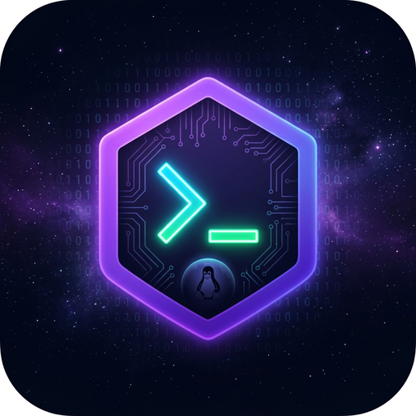
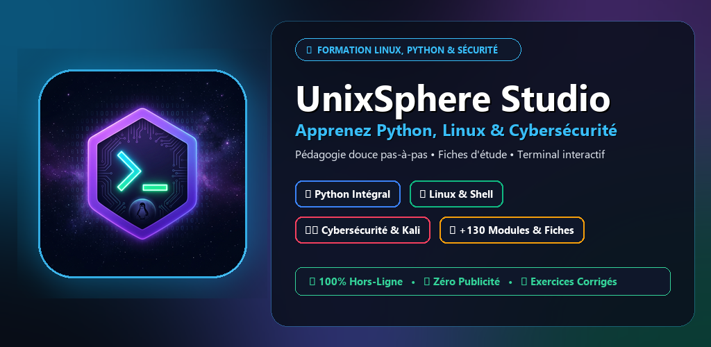
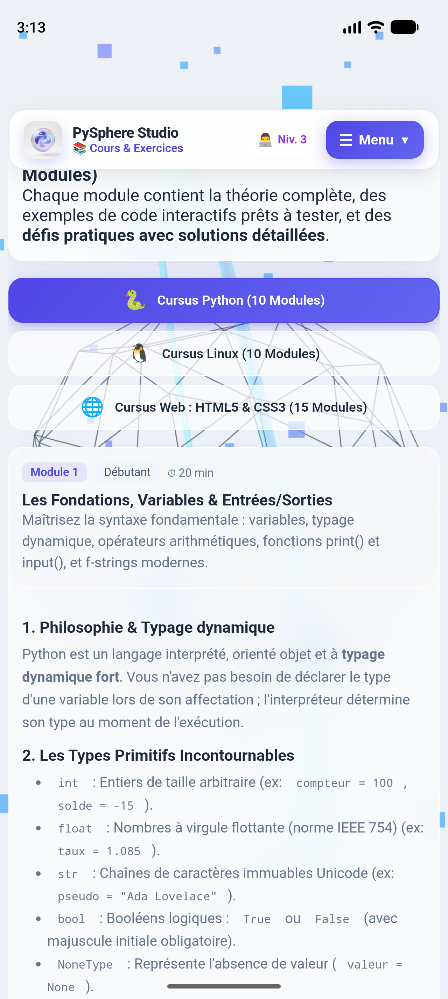
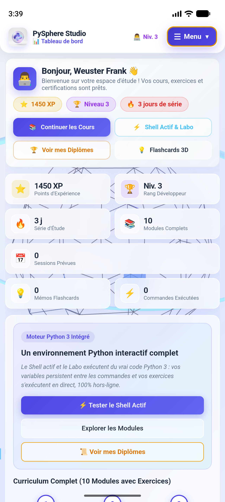
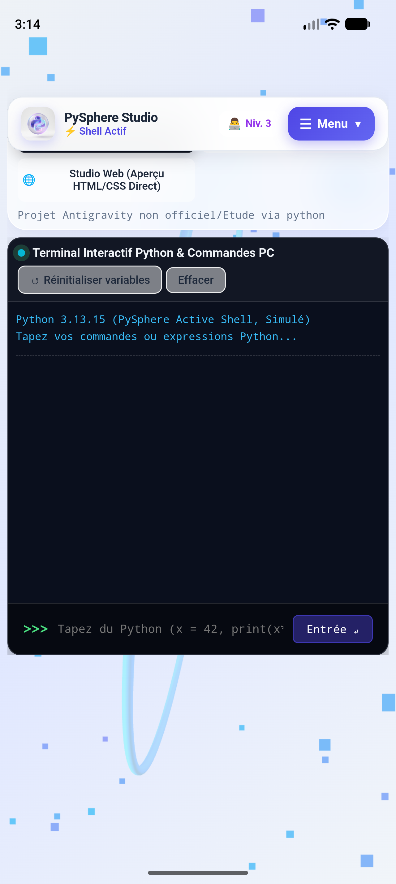
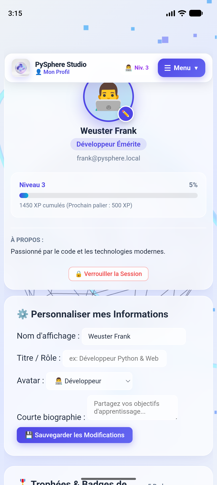

  

  # UnixSphere Studio
  
  **L'académie mobile d'apprentissage de Python, Linux & Cybersécurité.**
  
  
  
  
  

   

  🌐 **[Consulter le Site Web Vitrine Officiel](https://frankweuster127.github.io/unixsphere-studio/)** • 📲 **[Télécharger sur Google Play](https://play.google.com/store/apps/details?id=com.UnixSphereStudio)**

   

  

---

## 🌟 Présentation

**UnixSphere Studio** est une application mobile complète conçue pour apprendre et maîtriser l'informatique système, la programmation et la cybersécurité depuis votre smartphone.

Grâce à une pédagogie progressive basée sur des **analogies du monde réel**, des **fiches récapitulatives** et des **alertes pièges**, vous montez en compétences pas-à-pas sans jargon incompréhensible.

### ⚡ Les Points Forts :
* ✈️ **100% Hors-ligne** : Apprenez partout (transports, voyage, sans connexion).
* 🐚 **Terminal Shell Linux Intégré** : Exécutez de vraies commandes Unix simulées directement dans votre poche.
* 🐍 **Bac à Sable Python Interactif** : Testez vos scripts et algorithmes en temps réel.
* 📑 **30 Fiches Mémo de Référence** : Aide-mémoires et tableaux syntaxiques prêts à l'emploi.
* 🎓 **Certificat d'Aptitude Officiel** : Validez vos connaissances avec l'Examen Final intégré.
* 💎 **Achat unique à vie** : Zéro abonnement, zéro publicité, respect total de la vie privée.

---

## 📚 Les 4 Cursus (130+ Modules)

| Cursus | Modules | Description & Compétences |
| :--- | :---: | :--- |
| 🐍 **Python Masterclass** | **20 Modules** | Variables, structures de données, boucles, fonctions, programmation orientée objet (POO), gestion des exceptions, scripts d'automatisation. |
| 🐧 **Fondamentaux Linux** | **25 Modules** | Hiérarchie Unix FHS (`/etc`, `/var`, `/home`), droits d'accès `chmod`/`chown`, tuyaux (pipes), redirections, filtres `grep`/`awk`/`sed`, gestion des processus. |
| 🛡️ **Cybersécurité & Kali** | **25 Modules** | Modèle TCP/IP, reconnaissance réseau avec Nmap, analyse de trames Wireshark, notions de cryptographie, durcissement et hacking éthique. |
| 🚀 **Ingénierie & DevOps** | **15 Modules** | Virtualisation vs Conteneurs Docker, Dockerfiles, Docker Compose, Git avancé (rebase, merge, cherry-pick), pipelines CI/CD et supervision. |
| 📑 **Fiches de Référence** | **30 Fiches** | Tableaux mémos des commandes Linux, codes HTTP, regex cheat-sheet, drapeaux Nmap, raccourcis et bibliothèques Python. |

---

## 📱 Aperçu de l'Interface

  <table border="0">
    <tr>
      <td width="25%" align="center">
        
         <b>Cours & Fiches didactiques</b>
      </td>
      <td width="25%" align="center">
        
         <b>Terminal Shell Interactif</b>
      </td>
      <td width="25%" align="center">
        
         <b>Playground Python</b>
      </td>
      <td width="25%" align="center">
        
         <b>Certificat d'Aptitude</b>
      </td>
    </tr>
  </table>

---

## 🛡️ Respect de la Vie Privée & Données

UnixSphere Studio fonctionne en local sur votre appareil. Aucune donnée personnelle, identifiant publicitaire ou historique d'apprentissage n'est collecté, partagé ou revendu.

Consultez notre [Politique de Confidentialité Officielle](privacy_policy.html).

---

  © 2026 UnixSphere Studio • Développé pour les passionnés de code & d'administration système.

